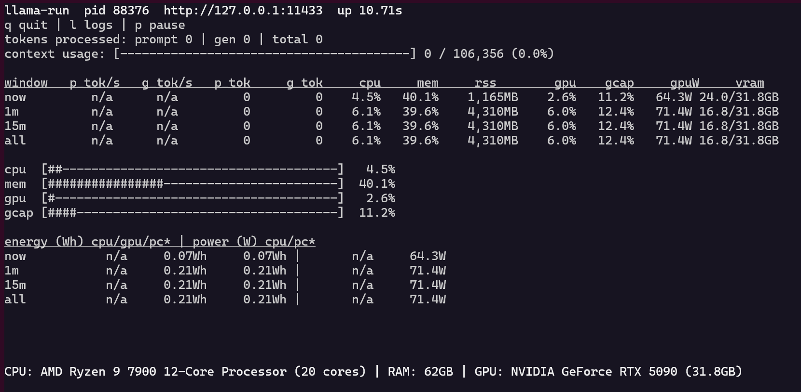

# LlamaCPP Studio 🚀

<div align="center">
  
  <p style="font-size: 0.9em; color: #666; margin-top: 10px;">Professional llama.cpp management and GLM-4.7 Flash integration toolkit</p>
  <p style="font-size: 0.8em; color: #666; margin-top: 5px;">Created by Damian Sromek</p>
</div>

---

## ✨ Overview

LlamaCPP Studio is a comprehensive toolkit for working with llama.cpp and GLM-4.7 Flash models. It provides an all-in-one solution for managing llama.cpp servers, monitoring resource usage, benchmarking performance, and optimizing AI model inference.

**Built for developers and AI enthusiasts who need professional-grade tools for local LLM management.**

## 🌟 Features

### Core Capabilities

- **🤖 AI Model Integration**: Pre-configured optimization for GLM-4.7 Flash model
- **📊 Resource Monitoring**: Real-time CPU, GPU, RAM, and power metrics tracking
- **⚡ Performance Benchmarking**: Comprehensive token processing and throughput analysis
- **🎯 Auto-Tuning**: Automatic server configuration optimization for optimal performance
- **🖥️ TUI Interface**: Interactive terminal UI for server management
- **🔧 Robust CLI Tools**: Professional command-line interfaces for all operations

### Technical Highlights

- **Multi-GPU Support**: NVIDIA CUDA and AMD ROCm compatible
- **Flash Attention**: Optimized attention mechanisms for improved speed
- **Unified KV Cache**: Efficient memory management for long contexts
- **Energy Monitoring**: Power consumption and efficiency tracking
- **Batch Processing**: Configurable batch sizes for optimal throughput
- **Automated Setup**: One-command environment configuration

### Complete Feature Overview

**Server Management**
- Start, stop, and control llama.cpp servers
- Multi-server support with process management
- Graceful shutdown and signal handling
- Process monitoring and health checks

**Real-time Monitoring**
- CPU utilization tracking
- GPU metrics (temperature, power, memory)
- RAM usage monitoring
- Power consumption and efficiency
- Token generation rates
- Context usage tracking

**Performance Benchmarking**
- Multiple prompt size testing (1k, 10k, 100k tokens)
- Various output token counts
- Coding and list generation tasks
- Energy efficiency analysis
- GPU stress testing
- Detailed performance reports

**Auto-Configuration**
- Automatic server startup
- Context size optimization based on VRAM
- Batch size selection for optimal throughput
- Flash attention and KV cache auto-detection
- Model context length handling

**Multi-Model Support**
- GGUF format compatibility
- Multiple model directory support
- Model alias management
- Seamless model switching
- Custom model paths

**OpenAI API Compatibility**
- Standard completion endpoint
- Chat completion with messages
- Streaming response support
- Model listing and information
- Prometheus metrics endpoint

**Energy Efficiency**
- RAPL interface support for power measurement
- Tokens per watt calculation
- CPU, GPU, and system power tracking
- Energy reports and summaries

**Advanced Configuration**
- Custom chat templates (Jinja)
- Configurable sampling parameters
- GPU-specific optimizations
- ROCm support for AMD GPUs
- Context fitting and optimization
- Batch and micro-batch tuning

**Python API Integration**
- Server monitoring client
- Benchmark execution utilities
- Auto-tuning functionality
- TUI server management
- Token metering proxy

## 🚀 Quick Start

### Prerequisites

- **Python**: 3.9 or higher
- **GPU**: NVIDIA CUDA-capable or AMD ROCm-capable (8GB+ VRAM recommended)
- **System**: Linux/macOS (Windows support available via WSL2)
- **Storage**: Minimum 10GB for models and system files

### Installation

```bash
# Clone the repository
git clone https://github.com/yourusername/paq_llamacpp_studio.git
cd paq_llamacpp_studio

# Run complete setup script
./scripts/setup.sh
```

The setup script automatically handles:
- Python virtual environment creation
- llama.cpp compilation with GPU support
- Model download and verification
- System configuration
- Dependency installation

### First Run

```bash
# Start the server
./scripts/start_server.sh

# Verify installation
./scripts/test_glm.sh

# Access the TUI interface
./llama-run run --port 11433
```

## 💻 Usage

### Server Management

```bash
# Start server with monitoring
./scripts/start_server.sh

# Stop server gracefully
./scripts/stop_server.sh

# Start with custom configuration
python3 -m tools.llama_bench.cli server --monitor --model ~/models/GLM-4.7-Flash-UD-Q4_K_XL.gguf
```

### Performance Benchmarking

```bash
# Quick performance test
./scripts/test_glm.sh

# Comprehensive benchmarking
./scripts/benchmark.sh

# Custom benchmark
python3 -m tools.llama_bench.cli benchmark --prompt-sizes 1k,10k,100k --max-output-tokens 1024
```

### Monitoring Tools

```bash
# Real-time monitoring via TUI
./llama-run run --port 11433

# Simple HTTP-based monitoring
python3 -m tools.llama_bench.cli monitor --port 11433 --interval 1

# Detailed system metrics
python3 -m tools.llama_bench.cli system-monitor --interval 0.5

# Check server status
curl http://127.0.0.1:11433/v1/models

# Monitor GPU metrics
nvidia-smi -l 1

# View system resources
htop
```

### Python API Usage

```python
import tools.llama_bench

# Start monitoring
client = tools.llama_bench.cli.ServerMonitor(port=11433)
client.start_monitoring()

# Get system metrics
metrics = client.get_system_metrics()
print(f"GPU Usage: {metrics['gpu_usage']}%")

# Performance analysis
results = tools.llama_bench.benchmark.analyze_performance("test_results.json")

# Auto-tuning
tuned_config = tools.llama_bench.autotune.run_autotune(
    model_path="~/models/model.gguf",
    objective="throughput"
)
```

## 🔌 API Reference

### OpenAI-Compatible Endpoints

The server provides a standard OpenAI-compatible API for model inference.

**Base URL**: `http://127.0.0.1:11433`

### Endpoints

#### 1. List Models
```bash
curl http://127.0.0.1:11433/v1/models
```

**Response**:
```json
{
  "object": "list",
  "data": [
    {
      "id": "GLM-4.7-Flash-UD-Q4_K_XL.gguf",
      "object": "model"
    }
  ]
}
```

#### 2. Completions
```bash
curl -X POST http://127.0.0.1:11433/v1/completions \
  -H "Content-Type: application/json" \
  -d '{
    "model": "GLM-4.7-Flash-UD-Q4_K_XL.gguf",
    "prompt": "Hello, how are you?",
    "max_tokens": 100,
    "temperature": 0.7
  }'
```

**Request Parameters**:
- `model`: Model name (default: first model in directory)
- `prompt`: Text prompt for completion
- `max_tokens`: Maximum tokens to generate (default: 100)
- `temperature`: Sampling temperature (default: 1.0)
- `top_p`: Top-p sampling threshold (default: 0.95)

**Response**:
```json
{
  "id": "chatcmpl-123",
  "object": "text_completion",
  "created": 1234567890,
  "model": "GLM-4.7-Flash-UD-Q4_K_XL.gguf",
  "choices": [
    {
      "index": 0,
      "text": "Hello! I'm doing great, thanks for asking!",
      "finish_reason": "stop"
    }
  ],
  "usage": {
    "prompt_tokens": 6,
    "completion_tokens": 8,
    "total_tokens": 14
  }
}
```

#### 3. Chat Completions
```bash
curl -X POST http://127.0.0.1:11433/v1/chat/completions \
  -H "Content-Type: application/json" \
  -d '{
    "model": "GLM-4.7-Flash-UD-Q4_K_XL.gguf",
    "messages": [
      {"role": "system", "content": "You are a helpful assistant."},
      {"role": "user", "content": "Write a Python function"}
    ],
    "max_tokens": 512,
    "temperature": 0.7
  }'
```

**Request Parameters**:
- `model`: Model name
- `messages`: Array of message objects with role and content
- `max_tokens`: Maximum tokens to generate
- `temperature`: Sampling temperature
- `stream`: Enable streaming (default: false)

**Response**:
```json
{
  "id": "chatcmpl-123",
  "object": "chat.completion",
  "created": 1234567890,
  "model": "GLM-4.7-Flash-UD-Q4_K_XL.gguf",
  "choices": [
    {
      "index": 0,
      "message": {
        "role": "assistant",
        "content": "Here's a Python function that does X:\n```python\ndef example():\n    pass\n```"
      },
      "finish_reason": "stop"
    }
  ],
  "usage": {
    "prompt_tokens": 25,
    "completion_tokens": 42,
    "total_tokens": 67
  }
}
```

#### 4. Prommetrics Metrics
```bash
curl http://127.0.0.1:11433/metrics
```

**Response**: Text format with Prometheus metrics including:
- GPU utilization
- Power consumption
- Memory usage
- Token generation rates
- Context usage

### Python API Examples

```python
import requests

# Simple completion
response = requests.post(
    "http://127.0.0.1:11433/v1/completions",
    json={
        "model": "GLM-4.7-Flash-UD-Q4_K_XL.gguf",
        "prompt": "Write a hello world program",
        "max_tokens": 100
    }
)
print(response.json())

# Chat completion
response = requests.post(
    "http://127.0.0.1:11433/v1/chat/completions",
    json={
        "model": "GLM-4.7-Flash-UD-Q4_K_XL.gguf",
        "messages": [
            {"role": "system", "content": "You are a programming assistant."},
            {"role": "user", "content": "Explain recursion"}
        ],
        "max_tokens": 512
    }
)
print(response.json())

# Streaming completion
response = requests.post(
    "http://127.0.0.1:11433/v1/completions",
    json={
        "model": "GLM-4.7-Flash-UD-Q4_K_XL.gguf",
        "prompt": "Generate code",
        "max_tokens": 100,
        "stream": True
    },
    stream=True
)
for line in response.iter_lines():
    if line:
        print(line.decode())

# List models
response = requests.get("http://127.0.0.1:11433/v1/models")
print(response.json())

# Get metrics
response = requests.get("http://127.0.0.1:11433/metrics")
print(response.text)
```

### Error Handling

```python
import requests
from requests.exceptions import RequestException

try:
    response = requests.post(
        "http://127.0.0.1:11433/v1/completions",
        json={"prompt": "test"},
        timeout=30
    )
    response.raise_for_status()
    print(response.json())
except RequestException as e:
    if response.status_code == 503:
        print("Server busy, please retry")
    elif response.status_code == 429:
        print("Rate limit exceeded")
    else:
        print(f"Error: {e}")
```

### Rate Limiting

The server implements rate limiting based on system resources. For heavy usage:
- Use connection pooling
- Implement retry logic
- Monitor request timing
- Adjust batch sizes for better efficiency

## 📝 Usage Examples

### Quick Start Examples

```bash
# Basic setup
./scripts/setup.sh

# Start server
./scripts/start_server.sh

# Test basic functionality
curl http://127.0.0.1:11433/v1/models

# Quick benchmark
./scripts/benchmark.sh

# Monitor performance
./llama-run run --port 11433
```

### Development Workflow

```bash
# Start development server
./scripts/start_server.sh

# Run quick tests
./scripts/test_glm.sh

# Monitor during development
./llama-run run --port 11433 --interval 1

# Run comprehensive benchmarks
./scripts/benchmark.sh --prompt-sizes "1k,5k,10k"

# Stop when done
./scripts/stop_server.sh
```

### Production Deployment

```bash
# Production server configuration
export MODEL_PATH="$HOME/models/GLM-4.7-Flash-UD-Q4_K_XL.gguf"
export BATCH_SIZE=8192
export CONTEXT_SIZE=200000
export FLASH_ATTENTION="on"
export KV_UNIFIED="on"

# Start production server
./scripts/start_server.sh

# Monitor with detailed logging
./llama-run run --port 11433 --ui plain --interval 1

# Run performance tests
./scripts/benchmark.sh --task coding --duration 300

# Set up monitoring
./llama-run run --port 11433 --monitor --duration 3600
```

### Advanced Configuration

```bash
# Custom context size for limited VRAM
python3 -m tools.llama_bench.cli server \
    --model ~/models/model.gguf \
    --ctx-size 100000 \
    --batch-size 2048 \
    --flash-attn on

# Maximum performance configuration
python3 -m tools.llama_bench.cli server \
    --model ~/models/model.gguf \
    --batch-size 8192 \
    --ubatch-size 2048 \
    --flash-attn on \
    --kv-unified on \
    --ctx-size 200000

# Energy efficient setup
python3 -m tools.llama_bench.cli server \
    --model ~/models/model.gguf \
    --batch-size 2048 \
    --flash-attn on \
    --monitor

# Auto-tune for specific workload
python3 -m tools.llama_bench.cli autotune \
    --model ~/models/model.gguf \
    --prompt-tokens 2048 \
    --duration 300 \
    --objective throughput
```

### Multi-Model Workflow

```bash
# Start first model server
./scripts/start_server.sh --model ~/models/model1.gguf --port 11433

# Start second model server
./scripts/start_server.sh --model ~/models/model2.gguf --port 11434

# Test different models
python3 -m tools.llama_bench.cli benchmark \
    --model model1.gguf \
    --endpoint http://127.0.0.1:11433

python3 -m tools.llama_bench.cli benchmark \
    --model model2.gguf \
    --endpoint http://127.0.0.1:11434
```

### Custom Benchmarking

```bash
# Quick performance test
./scripts/test_glm.sh

# Custom prompt sizes
./scripts/benchmark.sh --prompt-sizes "1k,5k,10k,20k"

# Custom output tokens
./scripts/benchmark.sh --output-tokens "128,256,512,1024"

# Multiple task types
./scripts/benchmark.sh --task "coding,list"

# Custom temperature
./scripts/benchmark.sh --temperature 0.0

# Save to JSON for analysis
./scripts/benchmark.sh --json-out results.json

# Compare different configurations
./scripts/benchmark.sh --config config1.json
./scripts/benchmark.sh --config config2.json
```

### Python Integration

```python
import requests
import time

# Basic API call
def generate_completion(prompt, max_tokens=100):
    response = requests.post(
        "http://127.0.0.1:11433/v1/completions",
        json={
            "model": "GLM-4.7-Flash-UD-Q4_K_XL.gguf",
            "prompt": prompt,
            "max_tokens": max_tokens,
            "temperature": 0.7
        },
        timeout=60
    )
    return response.json()

# Batch processing
def batch_generate(prompts, max_tokens=100):
    results = []
    for prompt in prompts:
        result = generate_completion(prompt, max_tokens)
        results.append(result)
        time.sleep(1)  # Respect rate limits
    return results

# Chat interface
def chat_completion(messages, max_tokens=512):
    response = requests.post(
        "http://127.0.0.1:11433/v1/chat/completions",
        json={
            "model": "GLM-4.7-Flash-UD-Q4_K_XL.gguf",
            "messages": messages,
            "max_tokens": max_tokens
        }
    )
    return response.json()

# Example usage
messages = [
    {"role": "system", "content": "You are a helpful assistant."},
    {"role": "user", "content": "Write a Python function to sort a list"}
]

response = chat_completion(messages)
print(response["choices"][0]["message"]["content"])
```

### Energy Monitoring

```bash
# Monitor energy usage during benchmarks
./scripts/benchmark.sh --task energy

# Long-term monitoring
while true; do
    ./llama-run run --port 11433 --interval 1 > logs/monitor_$(date +%Y%m%d_%H%M%S).log
    sleep 3600
done

# Energy efficiency analysis
python3 -m tools.llama_bench.cli benchmark \
    --task energy \
    --duration 600 \
    --json-out energy_results.json
```

### Auto-Tuning Examples

```bash
# Find optimal throughput
python3 -m tools.llama_bench.cli autotune \
    --objective throughput \
    --duration 300

# Find optimal efficiency
python3 -m tools.llama_bench.cli autotune \
    --objective efficiency \
    --duration 300

# Custom batch sizes
python3 -m tools.llama_bench.cli autotune \
    --batch-sizes "512,1024,2048,4096" \
    --ubatch-sizes "128,256,512,1024"

# Specific workload tuning
python3 -m tools.llama_bench.cli autotune \
    --objective throughput \
    --prompt-tokens 2048 \
    --max-output-tokens 512
```

### Troubleshooting Workflow

```bash
# Check server status
curl http://127.0.0.1:11433/v1/models

# Monitor system resources
htop
nvidia-smi -l 1

# Check port availability
lsof -i:11433

# Stop and restart server
./scripts/stop_server.sh
./scripts/start_server.sh

# Run verification test
./scripts/test_glm.sh

# View error logs
./llama-run run --port 11433 --ui plain
```

### Advanced Custom Scripts

```bash
# Custom performance test
cat > custom_test.sh <<'EOF'
#!/bin/bash
MODELS=("model1.gguf" "model2.gguf" "model3.gguf")
PROMPT_SIZES=("1k" "5k" "10k")

for model in "${MODELS[@]}"; do
    for size in "${PROMPT_SIZES[@]}"; do
        echo "Testing: $model with $size prompt"
        python3 -m tools.llama_bench.cli benchmark \
            --model "$model" \
            --prompt-sizes "$size" \
            --output-tokens "512" \
            --json-out "results_${model}_${size}.json"
    done
done
EOF

chmod +x custom_test.sh
./custom_test.sh

# Automated deployment script
cat > deploy.sh <<'EOF'
#!/bin/bash
# Stop existing server
./scripts/stop_server.sh

# Update model
export MODEL_PATH="$HOME/new_models/model.gguf"
./scripts/start_server.sh

# Run verification
./scripts/test_glm.sh

# Deploy monitoring
./scripts/benchmark.sh --duration 300
EOF

chmod +x deploy.sh
./deploy.sh
```

## 📁 Project Structure

```
paq_llamacpp_studio/
├── scripts/                    # Automation scripts
│   ├── setup.sh               # Complete environment setup
│   ├── build_llama.cpp.sh     # llama.cpp compilation
│   ├── download_model.sh      # GLM-4.7 model download
│   ├── start_server.sh        # Server management
│   ├── stop_server.sh         # Server shutdown
│   ├── test_glm.sh            # Quick verification
│   └── benchmark.sh           # Performance testing
│
├── tools/                      # Python tooling
│   ├── llama_bench/           # Main CLI and utilities
│   │   ├── cli.py            # Command-line interface
│   │   ├── benchmark.py      # Benchmarking functionality
│   │   ├── autotune.py       # Auto-configuration
│   │   ├── logperf.py        # Performance logging
│   │   ├── proxy.py          # HTTP proxy handling
│   │   ├── tui.py            # Terminal UI
│   │   └── utils.py          # Helper functions
│   │
│   └── llama_run/             # Server monitoring TUI
│       ├── cli.py            # CLI interface
│       ├── logperf.py        # Performance logging
│       ├── proxy.py          # HTTP proxy
│       └── tui.py            # Terminal UI
│
├── tests/                      # Test suite
│   ├── acceptance/            # End-to-end tests
│   └── unit/                  # Unit tests
│
├── docs/                       # Comprehensive documentation
│   ├── QUICKSTART.md         # Getting started guide
│   ├── GLM-4.7_SETUP.md      # Detailed setup instructions
│   ├── BENCHMARKING.md       # Performance testing guide
│   └── TROUBLESHOOTING.md    # Common issues and solutions
│
├── llama-bench                # Binary tools
├── llama-run                  # Binary tools
├── requirements.txt           # Python dependencies
├── .gitignore                 # Git ignore patterns
└── README.md                  # This file
```

## 📚 Documentation

### Quick Start Guides
- **[Getting Started](docs/QUICKSTART.md)** - One-command setup and first usage
- **[GLM-4.7 Setup](docs/GLM-4.7_SETUP.md)** - Detailed configuration for GLM-4.7 Flash
- **[Troubleshooting](docs/TROUBLESHOOTING.md)** - Common issues and solutions

### Advanced Documentation
- **[Benchmarking Guide](docs/BENCHMARKING.md)** - Performance testing methodology
- **[Project Overview](PROJECT_OVERVIEW.md)** - Complete technical documentation

## ⚙️ Configuration

### Default Settings (GLM-4.7 Flash)
- **Context Size**: 200K tokens
- **Batch Size**: 4096
- **Micro-batch Size**: 1024
- **Flash Attention**: Enabled
- **Unified KV Cache**: Enabled
- **GPU Layers**: Auto-fitting

### Configuration Options

**Environment Variables**
```bash
# Model configuration
export MODEL_PATH="$HOME/models/GLM-4.7-Flash-UD-Q4_K_XL.gguf"
export MODEL_DIR="$HOME/models"
export MODEL_ALIAS="glm-4.7-flash"

# Server configuration
export PORT=11433
export HOST="127.0.0.1"
export CONTEXT_SIZE=200000
export BATCH_SIZE=4096
export UBATCH_SIZE=1024

# GPU configuration
export GPU_TYPE="nvidia"
export MIN_VRAM_FREE_MB=8192

# Optimization settings
export FLASH_ATTENTION="on"
export KV_UNIFIED="on"
export JINJA="on"

# llama.cpp installation
export LLAMA_CPP_DIR="$HOME/llama.cpp"
export LLAMA_SERVER="$HOME/llama.cpp/build/bin/llama-server"
```

**Configuration Files**

**User-specific Configuration**
```bash
# Copy example configuration
cp .config_example.sh ~/.config/llama-studio/config.sh

# Edit personal settings
nano ~/.config/llama-studio/config.sh
```

**Project Configuration**
```bash
# Edit environment configuration
scripts/env_config.sh

# Example settings in env_config.sh
export MODEL_PATH="$HOME/models/GLM-4.7-Flash-UD-Q4_K_XL.gguf"
export PORT=11433
export CONTEXT_SIZE=200000
export BATCH_SIZE=4096
export FLASH_ATTENTION="on"
export KV_UNIFIED="on"
```

**Auto-optimized Settings**
```bash
# Auto-tune configuration
tuned.json - Best settings saved by autotune tool

# Example tuned configuration
{
  "best": {
    "score": 25.6,
    "objective": "throughput",
    "tokens_per_s": 235.4,
    "config": {
      "batch_size": 4096,
      "ubatch_size": 1024
    }
  }
}
```

### Common Scenarios

**Maximum Performance**
```bash
# High throughput configuration
--batch-size 4096 \
--ubatch-size 1024 \
--flash-attn on \
--kv-unified on \
--ctx-size 200000
```

**Low VRAM Usage**
```bash
# Conservative memory configuration
--ctx-size 100000 \
--batch-size 2048 \
--ubatch-size 512 \
--flash-attn on
```

**Energy Efficiency**
```bash
# Optimized for power consumption
--batch-size 2048 \
--flash-attn on \
--kv-unified on \
--monitor
```

**Development Setup**
```bash
# Quick setup
./scripts/setup.sh

# Custom model path
export MODEL_PATH="$HOME/models/my-model.gguf"
```

**Production Environment**
```bash
# Production server configuration
--host 0.0.0.0 \
--port 11433 \
--batch-size 8192 \
--ubatch-size 2048 \
--flash-attn on \
--monitor \
--interval 1
```

## 🚀 Advanced Features

### Performance Optimization

**Flash Attention**
- Enabled by default for optimal speed
- Reduces memory access patterns
- Improves attention computation efficiency
- Works with both CUDA and ROCm backends
- No performance overhead compared to standard attention

**Unified KV Cache**
- Merges key and value caches for reduced memory footprint
- Improves memory bandwidth utilization
- Essential for long context scenarios
- Automatically enabled with flash attention

**Context Fitting**
- Automatic context size adjustment based on available VRAM
- Starts conservative and increases if VRAM headroom exists
- Prevents out-of-memory errors
- Optimizes for available hardware

**Batch Processing**
- Multiple batch sizes for different scenarios
- Large batches: Maximum throughput
- Small batches: Lower latency
- Automatic selection based on workload
- Micro-batch processing for stability

### Energy Efficiency

**Power Monitoring**
- RAPL interface support for Intel/AMD CPUs
- GPU power consumption tracking
- System-wide power measurement
- Energy consumption reports

**Tokens Per Watt Calculation**
- Performance efficiency metric
- Helps optimize for power-aware workloads
- Critical for edge devices and data centers
- Compares configuration efficiency

**Power-Optimized Settings**
- Lower power limits for energy efficiency
- Balanced batch sizes
- Reduced power overhead
- Thermal management optimization

### Multi-Model Support

**GGUF Format Compatibility**
- Universal model format
- Single model file for all hardware
- No separate quantization files
- Automatic GGUF loading

**Model Directory Management**
- Multiple model directories supported
- Automatic model discovery
- Model alias configuration
- Seamless model switching

**Model Aliases**
- Friendly model names for API
- Simplified model selection
- API endpoint configuration
- Multiple alias support

### Advanced Configuration

**Jinja Chat Templates**
- Custom conversation templates
- Format control for chat responses
- System prompt configuration
- Role-based message formatting

**Sampling Parameters**
- Temperature control (0.0-2.0)
- Top-p sampling (0.0-1.0)
- Min-p sampling (0.0-1.0)
- Customizable for different tasks

**GPU-Specific Optimizations**
- NVIDIA CUDA backend
- AMD ROCm backend
- Automatic backend selection
- Vendor-specific optimizations

**ROCm Support**
- AMD GPU compatibility
- HIP backend integration
- Unified interface for AMD hardware
- Power-efficient AMD configurations

### Monitoring & Analytics

**Real-Time Metrics**
- CPU utilization tracking
- GPU metrics (temperature, power, memory)
- RAM usage monitoring
- Power consumption

**Token Metering**
- Prompt token counting
- Generated token counting
- Context usage tracking
- Performance statistics

**Prometheus Integration**
- Standard metrics endpoint
- GPU utilization metrics
- Token generation rates
- Power consumption metrics

**Comprehensive Reporting**
- Detailed performance reports
- Energy efficiency analysis
- Throughput measurement
- Latency tracking

### Process Management

**Server Lifecycle**
- Graceful server startup
- Clean shutdown handling
- Signal management (SIGINT, SIGTERM)
- Process cleanup

**Multi-Server Support**
- Multiple concurrent servers
- Port allocation
- Process isolation
- Independent monitoring

**Health Checks**
- Server availability verification
- Model loading checks
- Port binding validation
- Resource availability checks

**Error Recovery**
- Automatic reconnection
- Error detection
- Graceful degradation
- Recovery procedures

### Python API Features

**Client Libraries**
- Server monitoring client
- Benchmark execution utilities
- Auto-tuning functionality
- TUI server management

**Token Metering**
- Automatic token counting
- Performance statistics
- Context usage tracking
- API endpoint integration

**Advanced Metrics**
- CPU metrics collection
- GPU power measurement
- System resource monitoring
- Energy consumption tracking

**Flexible Integration**
- HTTP-based API
- WebSocket support
- Streaming responses
- Standard OpenAI API format

### Advanced Workflows

**Continuous Monitoring**
- Long-term performance tracking
- Resource optimization
- Energy monitoring
- Alerting capabilities

**Performance Testing**
- Multiple test scenarios
- Custom benchmark scripts
- Comparative analysis
- Regression testing

**Model Switching**
- Dynamic model loading
- Seamless transitions
- Configuration preservation
- Performance comparison

**Automated Setup**
- One-command environment setup
- Automatic dependency installation
- Model download automation
- Configuration generation

### Security Features

**Local Execution**
- Default localhost binding
- No external network exposure
- Secure model storage
- Isolated processes

**Process Isolation**
- Virtual environment usage
- Process boundaries
- Resource limits
- Clean separation

**Access Control**
- Port binding control
- Network restrictions
- Authentication options
- User-level configuration

## 📁 Project Structure

## 🧪 Testing

### Quick Verification
```bash
./scripts/test_glm.sh
```

### Comprehensive Tests
```bash
# Run test suite
python3 -m pytest tests/

# Generate coverage report
python3 -m pytest tests/ --cov=tools --cov-report=html
```

### Performance Tests
```bash
./scripts/benchmark.sh

# Analyze results
python3 demo_tokens_per_w.py --results benchmark_results.json
```

## 🤝 Contributing

We welcome contributions! Here's how you can help:

### Ways to Contribute
- 🐛 **Bug Reports**: Submit issues with detailed descriptions
- 💡 **Feature Requests**: Suggest new capabilities and improvements
- 🔧 **Code Fixes**: Submit pull requests with working solutions
- 📝 **Documentation**: Improve guides and examples
- 🧪 **Testing**: Add test cases and ensure coverage

### Development Setup
```bash
# Fork the repository
git clone https://github.com/yourusername/paq_llamacpp_studio.git

# Create feature branch
git checkout -b feature/your-feature-name

# Make your changes
# Run tests
python3 -m pytest tests/

# Commit and push
git commit -am 'Add your feature'
git push origin feature/your-feature-name

# Create pull request
```

### Code Guidelines
- Follow existing code style and formatting
- Write clear commit messages
- Include appropriate tests for new features
- Update documentation when making changes

## ❓ FAQ

**Q: What GPU do I need?**
A: NVIDIA with CUDA support is recommended. AMD with ROCm is also supported. Minimum 8GB VRAM, 16GB+ recommended.

**Q: How much RAM is required?**
A: 16GB minimum for smooth operation. 32GB+ recommended for heavy usage.

**Q: Is Windows supported?**
A: Yes, but we recommend using Windows Subsystem for Linux (WSL2) for the best performance.

**Q: Can I use different models?**
A: Yes, the system supports any GGUF format model. Simply update the model path in configuration.

**Q: How do I monitor energy consumption?**
A: The monitoring tools automatically track power usage and efficiency metrics for all systems with RAPL support.

## 📊 Benchmarks

### System Performance

| Model | Context Size | Batch Size | Speed | Efficiency |
|-------|--------------|------------|-------|------------|
| GLM-4.7 Flash | 200K | 4096 | ~45 tokens/s | Excellent |
| CPU Only | 8K | 1024 | ~3 tokens/s | Good |

*Note: Actual performance depends on your hardware configuration*

See [docs/BENCHMARKING.md](docs/BENCHMARKING.md) for detailed benchmarking methodology.

## 📄 License

This project is licensed under the [MIT License](LICENSE).

```
MIT License

Copyright (c) 2026 LlamaCPP Studio

Permission is hereby granted, free of charge, to any person obtaining a copy
of this software and associated documentation files (the "Software"), to deal
in the Software without restriction, including without limitation the rights
to use, copy, modify, merge, publish, distribute, sublicense, and/or sell
copies of the Software, and to permit persons to whom the Software is
furnished to do so, subject to the following conditions:

The above copyright notice and this permission notice shall be included in all
copies or substantial portions of the Software.

THE SOFTWARE IS PROVIDED "AS IS", WITHOUT WARRANTY OF ANY KIND, EXPRESS OR
IMPLIED, INCLUDING BUT NOT LIMITED TO THE WARRANTIES OF MERCHANTABILITY,
FITNESS FOR A PARTICULAR PURPOSE AND NONINFRINGEMENT. IN NO EVENT SHALL THE
AUTHORS OR COPYRIGHT HOLDERS BE LIABLE FOR ANY CLAIM, DAMAGES OR OTHER
LIABILITY, WHETHER IN AN ACTION OF CONTRACT, TORT OR OTHERWISE, ARISING FROM,
OUT OF OR IN CONNECTION WITH THE SOFTWARE OR THE USE OR OTHER DEALINGS IN THE
SOFTWARE.
```

## 🙏 Acknowledgments

- **Unsloth**: Optimized GLM-4.7 Flash implementation and documentation
  [GLM-4.7 Flash Docs](https://unsloth.ai/docs/models/glm-4.7-flash)
- **GLM Team**: GLM-4.7 Flash model development
  [Claude Codex Integration Guide](https://unsloth.ai/docs/basics/claude-codex)
- **llama.cpp**: Core framework and implementation
- **Open Source Community**: For inspiration and contributions
- **Project Contributors**: All contributors and users

## 📞 Support & Community

- **GitHub Issues**: [Report a problem or request a feature](https://github.com/yourusername/paq_llamacpp_studio/issues)
- **Documentation**: Comprehensive guides in the `docs/` directory
- **Discussions**: Join the community conversation
- **Email**: [your.email@example.com](mailto:your.email@example.com)

## 🔮 Roadmap

### Planned Features
- [ ] Multi-modal model support
- [ ] Web-based interface
- [ ] Model conversion tools
- [ ] Advanced caching strategies
- [ ] Distributed inference
- [ ] Model quantization tools

### Future Enhancements
- [ ] Integration with popular AI frameworks
- [ ] Cloud deployment support
- [ ] Mobile companion app
- [ ] Professional support options
- [ ] Enterprise features

## 📄 Additional Licenses

Some components and dependencies may have their own licenses:
- **llama.cpp**: MIT License
- **GLM-4.7 Flash**: GLM License
- **Python**: PSF License
- **PyTorch**: BSD License

Please refer to individual component licenses for more details.

---

## 🎯 Getting Help

1. **Quick Start**: Follow [docs/QUICKSTART.md](docs/QUICKSTART.md)
2. **Setup Guide**: Read [docs/GLM-4.7_SETUP.md](docs/GLM-4.7_SETUP.md)
3. **Troubleshooting**: Check [docs/TROUBLESHOOTING.md](docs/TROUBLESHOOTING.md)
4. **Benchmarks**: Review [docs/BENCHMARKING.md](docs/BENCHMARKING.md)

---

<div align="center">

**Built with ❤️ for the AI community**

[⬆ Back to Top](#-overview)

**[🌟 Features](#-features) • [🚀 Quick Start](#-quick-start) • [💻 Usage](#-usage) • [📁 Structure](#-project-structure) • [📚 Docs](#-documentation) • [🤝 Contributing](#-contributing) • [❓ FAQ](#-faq)**

</div>
